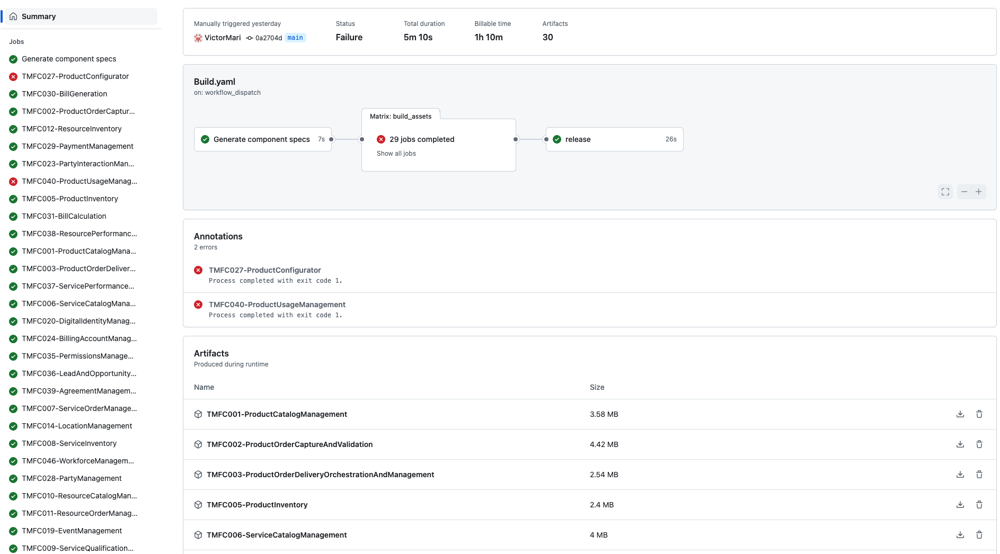

# ODA CTK execution
This file contains component installation in a canvas cluster; CTK (Conformance Test Kit) installation and running steps. 

## Prerequisites to run CTK

1. You need to have an access permission to a Canvas cluster or you need to setup canvas cluster to your local machine to deploy component. 
2. Deploy v1beta2 component to Canvas cluster.
    
    Make sure [Helm](https://helm.sh/docs/intro/install/) is deployed to deploy component helm package in Canvas cluster. 

    Please refer to below helm version:
    ```bash
    % helm version
    version.BuildInfo{Version:"v3.12.3",..}
    ```

    Deploy component to be tested by running sample command :
    ```bash
    %  helm install [release name] -n components [your component helm chart directory]
    ```

    Deployed component name would be "[release name]-{Chart.name}"

    Please check deployed component status running below command:
    ``` bash
    % kubectl get components -n components
    ```

3. Use the package manager by downloading [nodejs](https://nodejs.org/en/download/package-manager) to install and run CTK.
    
    Please refer below versions for npm and node.js:
    ```bash
    % npm -v
    10.8.1
    % node -v
    v22.4.1
    % python3 --version
    Python 3.9.6
    ```

## CTK configuration

1. Download the component artifact which is specific for your usecase from the latest [build](https://github.com/tmforum-rand/TMForum-ODA-CI/actions/workflows/Build.yaml), click on build and download component artifact from artifacts section. 


2. Go to the downloaded component artifact directory, then go to ctk source directory. Below sample is based on tmfc005-productinventory
``` bash
% cd TMFC005-ProductInventory/tmfc005-productinventory-ctk/src
```

4. Build packages under source folder of CTK directory

``` bash
% npm install 
```

5. Write component release to a file by running below command
```bash
% helm get manifest [release name] -n components > [component name].yaml
```

6. Configure ctkconfig.json under soruce folder of CTK directory
Change the mandatory field values like "componentFilePath" and "componentName". 

componentFilePath should be the directory where the component relase file is placed. 
componentName is the deployed component name. 

```json
{
    "componentFilePath": "../resources/component/component.yaml",
    "companyName": "",
    "componentName": "[release name]-tmfc005-productinventory",
    "productName": "",
    "componentUrl": "",
    "productUrl": "",
    "ctkConfig": {},
    "headers": {
        "Accept": "application/json",
        "Content-Type": "application/json"
    },
    "goldenComponentFilePath": "../resources/golden-components/TMFC005-ProductInventory.yaml",
    "payloads": {
        "TMF669_v4.0.0": {
            "PartyRole": {
                "POST": {
                    "payload": {
                        "name": "qqymucymyd"
                    }
                }
            }
        },
        "TMF637_v4.0.0": {}
    }
}
```
## Run CTK
 Finally you can run below command to run CTK, check the generated output as below log and produced reports in the resource folder. 

 ```bsh 
% npm start
```


```bsh 
% npm start

> component-ctk@0.0.1 start
> node index.js

  Step 0: Component file checs
  Step 0: Basic environment connectivity tests
Reading component file ../resources/component/component.yaml
    ✓ File exists
    ✓ File contains valid YAML

  Step 1: Component manifest checks
    ✓ Document of kind  'Component' is found
    ✓ Component api version is within supported versions
    ✓ Component has metadata field
    ✓ Component metadata has name and labels
    ✓ Component has spec field
    ✓ Spec has coreFunction with exposed and dependent APIs
    ✓ Spec has security function
    ✓ Security function has controller role and exposed apis
    ✓ Security has partyrole
    ✓ Security function has controller role field of type string
    ✓ All resources are labelled with the component name
    ✓ Golden component exists in ctk
    ✓ Apis defined in golden component must be specified in component manifest
    ✓ Kubectl configured correctly (136ms)

  Step 1: Deployment component tests
    ✓ Component can be found in namespace: components
    ✓ Component has deployed successfully (status: Complete)
    ✓ Test if all exposed api are accessible and return status is 200 (195ms)
    ✓ Security api must return at least one partyrole with controller role defined in component file (94ms)
Configuring CTK for product-inventory-management-api
Configuring CTK for party-role-management-api
Running command ../resources/api-ctks/TMF637_v4.0.0/ctk
Running command ../resources/api-ctks/TMF669_v4.0.0/ctk
    ✓ All swagger urls must be valid and accessible and contain valid x-api-id and version fields  (811ms)


  16 passing (876ms)

[mochawesome] Report JSON saved to /[..ctk directory..]/TMFC005-ProductInventory/tmfc005-productinventory-ctk/resources/results/baseline-ctk/Configuration-report.json

[mochawesome] Report HTML saved to /[..ctk directory..]/TMFC005-ProductInventory/tmfc005-productinventory-ctk/resources/results/baseline-ctk/Configuration-report.html

    ✓ CTKs for exposed apis have been executed successfully (4437ms)


  6 passing (5s)

[mochawesome] Report JSON saved to /[..ctk directory..]/TMFC005-ProductInventory/tmfc005-productinventory-ctk/resources/results/baseline-ctk/deployment-report.json

[mochawesome] Report HTML saved to /[..ctk directory..]/TMFC005-ProductInventory/tmfc005-productinventory-ctk/resources/results/baseline-ctk/deployment-report.html

../resources/results/cucumber-bdd/results.json string
Running BDD
..........

2 scenarios (2 passed)
10 steps (10 passed)
0m00.022s (executing steps: 0m00.003s)

🚀 Cucumber HTML report ../resources/results/cucumber-bdd/results.html generated successfully 👍
```

## Troubleshoots

To run CTK, deployed component status should be in "Completed".

Check the deployed component status with below comand : 
``` bash
    % kubectl get components -n components
```
Check exported Apis status with below command (implementation ready status should be true):
``` bash
    % kubectl get api -n components
```
Please be careful about the format of produced component manifest yaml. Yaml file should not contain windows characters.
